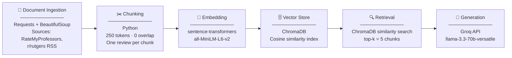

# Project 1 Planning: The Unofficial Guide

> Write this document before you write any pipeline code.
> Your spec and architecture diagram are what you'll use to direct AI tools (Claude, Copilot, etc.) to generate your implementation — the more specific they are, the more useful the generated code will be.
> Update the Retrieval Approach and Chunking Strategy sections if you change your approach during implementation.
> Update this file before starting any stretch features.

---

## Domain

<!-- What domain did you choose? Why is this knowledge valuable and hard to find through official channels? -->
The domain I chose was course and professor reviews. This knowledge is valuable because students need candid, experience-based feedback on teaching quality, workload, and grading to make informed enrollment decisions. It is hard to find through official channels because universities publish only sanitized course catalogs and aggregate satisfaction scores — they rarely share unfiltered student opinions about specific professors, exam difficulty, or how a course actually runs day-to-day.

---

## Documents

<!-- List your specific sources: URLs, subreddit names, forum threads, or file descriptions.
     Aim for at least 10 sources that together cover different subtopics or perspectives within your domain. -->

| # | Source | Description | URL or location |
|---|--------|-------------|-----------------|
| 1 | Rate My Professors — Rutgers NB | Student reviews of all Rutgers–New Brunswick professors with difficulty, helpfulness, and "would take again" ratings | https://www.ratemyprofessors.com/school/825 |
| 2 | r/rutgers — professor megathreads | Semester-start threads where students share professor picks and warnings for upcoming courses | https://www.reddit.com/r/rutgers/search/?q=professor+review&sort=top |
| 3 | r/rutgers — course difficulty threads | Discussions about specific course workloads, grading curves, and which sections to avoid | https://www.reddit.com/r/rutgers/search/?q=course+hard+easy+grade&sort=top |
| 4 | r/rutgers — "which professor should I take" threads | Direct Q&A posts where students ask and answer who to take for a given course | https://www.reddit.com/r/rutgers/search/?q=which+professor+should+I+take&sort=top |
| 5 | Rutgers Webreg course listings | Official course section data showing professor names, times, and seats — used to cross-reference reviews | https://sims.rutgers.edu/webreg/ |
| 6 | Rutgers CS department course descriptions | Official course catalog pages for CS courses to ground the domain in actual course names/numbers | https://www.cs.rutgers.edu/academics/undergraduate/course-synopses |
| 7 | Koofers — Rutgers NB professors | Ratings, exam archives, and grade distribution data for Rutgers professors | https://www.koofers.com/rutgers-the-state-university-of-new-jersey-new-brunswick/professors |
| 8 | Rate My Professors — Rutgers Math/Stats professors | Focused reviews for MATH and STAT courses that CS students commonly take | https://www.ratemyprofessors.com/search/professors/825?q=mathematics |
| 9 | r/rutgers — finals/midterm discussion threads | Posts about exam format and difficulty for specific courses, often naming professors | https://www.reddit.com/r/rutgers/search/?q=final+exam+midterm&sort=top |
| 10 | Rutgers SAS course evaluations summary (publicly shared) | Any publicly shared or screenshotted summaries of official course evaluation results posted by students to Reddit or course wikis | https://www.reddit.com/r/rutgers/search/?q=course+evaluation&sort=top |

---

## Chunking Strategy

<!-- How will you split documents into chunks?
     State your chunk size (in tokens or characters), overlap size, and explain why those
     numbers fit the structure of your documents.
     A review-heavy corpus warrants different chunking than a long FAQ. -->

**Chunk size:** 250 tokens

**Overlap:** 0

**Reasoning:** Each source document is one standalone review. Chunks are sized to contain exactly one review, so no overlap is needed.

---

## Retrieval Approach

<!-- Which embedding model are you using (e.g., all-MiniLM-L6-v2 via sentence-transformers)?
     How many chunks will you retrieve per query (top-k)?
     If you were deploying this for real users and cost wasn't a constraint, what tradeoffs
     would you weigh in choosing a different embedding model — context length, multilingual
     support, accuracy on domain-specific text, latency? -->

**Embedding model:** all-MiniLM-L6-v2

**Top-k:** 5

**Production tradeoff reflection:** all-MiniLM-L6-v2 is fast, free, and runs locally with no API dependency. It handles short texts like reviews well and its 256-token context limit fits our chunk size. The downside is lower semantic accuracy on informal language — it can miss nuanced signals like "the curve saved me" or "attendance tanked my grade," which are exactly what students search for.

---

## Evaluation Plan

<!-- List your 5 test questions with their expected correct answers.
     Questions should be specific enough that you can judge whether the system's response
     is right or wrong. "What are good dining halls?" is too vague.
     "What do students say about wait times at [dining hall name] during lunch?" is testable. -->

| # | Question | Expected answer |
|---|----------|-----------------|
| 1 | Which professor do students recommend most for Rutgers CS111? | Reviews point to one or two sections with [professor here] which have higher ratings for clarity and helpfulness, with students advising to avoid sections with [professor here] known for harsh grading. |
| 2 | Who is considered the easiest professor for Rutgers MATH151? | Students on Reddit and Rate My Professors identify [professor here] as significantly more lenient on grading and more exam-focused rather than homework-heavy. |
| 3 | What are common complaints students have about intro-level CS courses at Rutgers? | Reviews frequently cite large lecture sizes, limited professor availability during office hours, and fast-paced content coverage. |
| 4 | How do students describe the difficulty of CS111 at Rutgers compared to CS112? | Students consistently say CS111 is [differences here] compared to CS112. |
| 5 | What study strategies do Rutgers students recommend for surviving CS205? | Reviews suggest forming study groups, starting problem sets early, and reviewing past exams since the course is heavily proof-focused |

---

## Anticipated Challenges

<!-- What could go wrong? Name at least two specific risks with reasoning.
     Consider: noisy or inconsistent documents, missing source attribution, off-topic
     retrieval, chunks that split key information across boundaries. -->

1. **Off-topic retrieval:** A query like "easiest CS professor" might pull chunks about course difficulty or study tips rather than professor comparisons, because the embedding similarity is close but the content answers a different question. This happens when reviews mention difficulty without clearly attributing it to a specific professor.

2. **Noisy and vague review text:** Many student reviews are short, opinionated, and lack specifics (e.g., "great prof, easy A" with no course name). These chunks look relevant at retrieval time but don't actually help the LLM generate a useful answer, leading to confident-sounding responses with little real evidence behind them.

---

## Architecture

<!-- Draw a diagram of your pipeline showing the five stages:
     Document Ingestion → Chunking → Embedding + Vector Store → Retrieval → Generation
     Label each stage with the tool or library you're using.
     You can use ASCII art, a Mermaid diagram, or embed a sketch as an image.
     You'll use this diagram as context when prompting AI tools to implement each stage. -->

---

## AI Tool Plan

<!-- For each part of the pipeline below, describe:
     - Which AI tool you plan to use (Claude, Copilot, ChatGPT, etc.)
     - What you'll give it as input (which sections of this planning.md, which requirements)
     - What you expect it to produce
     - How you'll verify the output matches your spec

     "I'll use AI to help me code" is not a plan.
     "I'll give Claude my Chunking Strategy section and ask it to implement chunk_text()
     with my specified chunk size and overlap" is a plan. -->

**Milestone 3 — Ingestion and chunking:**
I'll give Claude my Documents table and Chunking Strategy section and ask it to scaffold `scrape_documents()` and `chunk_text()`. I'll then review the generated code, adjust any scraping logic that doesn't match the actual page structure, and manually test that chunks are 250 tokens or under and contain coherent review text.

**Milestone 4 — Embedding and retrieval:**
I'll give Claude the Retrieval Approach section and Architecture diagram and ask it to implement `embed_chunks()` with sentence-transformers and `retrieve()` with FAISS. I'll run the code myself and spot-check retrieved chunks against my 5 evaluation questions to confirm the results look relevant before moving on.

**Milestone 5 — Generation and interface:**
I'll give Claude the Architecture diagram and ask it to implement `generate_answer()` that builds a prompt from retrieved chunks and calls the Groq API. I'll write the final prompt template myself to make sure the tone and instructions match what I want, then test all 5 evaluation questions and compare responses to my expected answers.
